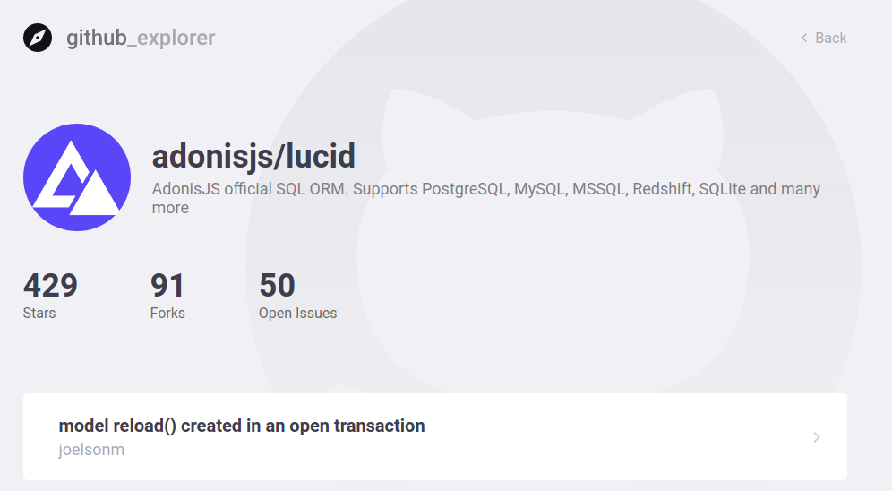

<div align="center">


This project uses the **Github API** to search and store repositories in _localstorage_.

</div>

---

To clone the repository:

```cmd
git clone https://github.com/victorradael/github_explorer.git
```

To install the dependencies use the command

```cmd
npm install
```

or, if you use **Yarn** use the command

```cmd
yarn
```

To run the project:

```cmd
yarn start
```

<div align="center">

## **Application Images**


When the repository is added, it is possible to consult a list of issues in the repository and see how many stars, forks and open issues the repository has. By clicking on the issue, you are redirected to the Github repository page for that issue.



### Project developed during the **GoStack Bootcamp** minitrated by **Rocketseat**.

---


</div>
